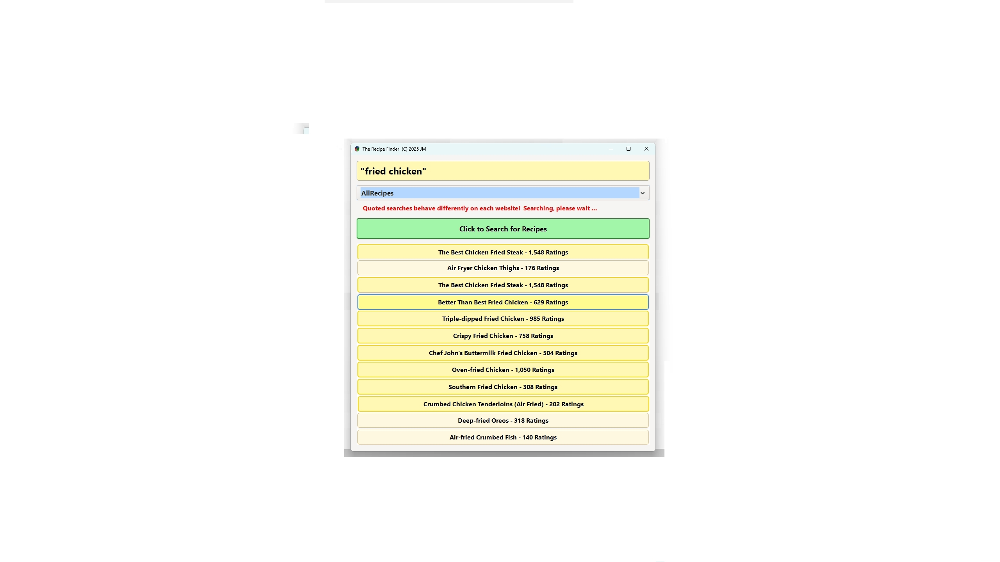

# 🥘 Recipe Finder

Recipe Finder is a cross-platform **C/GTK desktop app** for finding recipes, kitchen recipes, and food recipes across 20 major cooking websites — all from one unified interface.  

Written in **C (C11)** using **GTK 3**, it works on **Windows**, **macOS**, and Linux, and is built with **libcurl** for networking, **Gumbo** for HTML parsing, and optional **Node.js + Playwright** support for JavaScript-heavy sites.

> “Built as a hands-on C/GTK learning tool — not just to find recipes, but to cook up better code.” 
> — John Mastronardo, August 2025

---

## ✨ Features

- 🔎 Search 20 popular recipe websites from a single input field, including **AllRecipes, Epicurious, and Food Network**  
- 🌐 Site-specific parsers (C or Node.js) to extract links efficiently  
- 🧵 Asynchronous downloading and a responsive GTK UI  
- 💡 Lightweight, fast, and fully **cross-platform**  
- 🛠️ Automatic runtime checks for Node.js and required JS modules  
- 📜 Polished appearance via GTK CSS styling  
- 🖱️ Clicked recipe links open in the default browser  
- 📚 Well-documented source code for easy learning and extension  
- 🍳 Ideal for developers and cooking enthusiasts looking for a versatile **recipe-finder, food-app, or recipe-locator**

---

## 🌍 Supported Recipe Websites

1. AllRecipes  
2. BBC Good Food  
3. Bon Appétit  
4. Budget Bytes  
5. Chowhound  
6. Cooks Illustrated / America’s Test Kitchen  
7. Delish  
8. EatingWell  
9. Epicurious  
10. Food52  
11. Food Network  
12. NY Times Cooking  
13. The Kitchn  
14. Saveur  
15. Serious Eats  
16. Simply Recipes  
17. Smitten Kitchen  
18. The Spruce Eats  
19. Taste of Home  
20. Yummly  

---

## 🖼️ Screenshots

  
  
  

---

## 🛠️ Build Instructions

### 🔧 Prerequisites

Install the required libraries and tools for your platform:

- **GTK 3**: GUI toolkit for C  
- **libcurl**: Networking library  
- **json-c**: JSON handling in C  
- **Gumbo Parser**: HTML parsing  
- **Node.js** (optional, for JS-heavy parsers)  
- **npm packages**: `playwright`, `cheerio`, `axios`  

---

### 🖥️ Windows (MSYS2 / MinGW 64-bit)

1. Install MSYS2 and open the MinGW64 shell  
2. Install dependencies:

pacman -S mingw-w64-x86_64-gtk3 \
           mingw-w64-x86_64-json-c \
           mingw-w64-x86_64-curl \
           mingw-w64-x86_64-gumbo

Compile:

gcc -o recipe_finder.exe recipe_finder.c $(pkg-config --cflags --libs gtk+-3.0 json-c) -lcurl -lgumbo -Wall -Wextra -std=c11 -g

Run:

./recipe_finder.exe

🍏 macOS (via Homebrew)
Install Homebrew (if not already installed):

/bin/bash -c "$(curl -fsSL https://raw.githubusercontent.com/Homebrew/install/HEAD/install.sh)"
Install dependencies:

brew install gcc gtk+3 json-c curl gumbo-parser node npm
Install Node.js packages:

npm install -g playwright cheerio axios
npx playwright install

Compile:

gcc-13 $(pkg-config --cflags gtk+-3.0 json-c) -std=c11 -Wall -Wextra -g recipe_finder.c -o Recipe_Finder $(pkg-config --libs gtk+-3.0 json-c) -lcurl -lgumbo

Run:

./Recipe_Finder

🐧 Linux (General)
Ensure dependencies are installed via your distro’s package manager (apt, yum, dnf, etc.):

GTK+3, libcurl, json-c, Gumbo

Compile using a C11-compliant GCC compiler.

⚙️ Troubleshooting
Ensure you’re using a 64-bit C compiler.

Confirm pkg-config paths are set correctly.

On macOS, GTK3 may require XQuartz.

For Node.js parsers, verify npm packages are installed globally.

🚀 Usage
Windows:

./recipe_finder.exe
Linux / macOS:

./Recipe_Finder
🗓️ Future Plans
Add SQLite database for favorites and search history

Improve quoted/exact search logic

Support batch searches across all websites

Replace temporary JavaScript files with in-memory execution

Enhance error reporting and UTF-8 handling

Migrate to GTK 4

Explore portable mobile UI (iOS/iPadOS prototype)

⚠️ Known Issues
Web parsing may break if recipe sites significantly change their HTML

Some antivirus tools may flag generated Node.js scripts

Linux builds are untested but expected to work with minimal adjustments

Ⓜ️ License

This project is licensed under the PolyForm Noncommercial License 1.0.0.
For personal, educational, or research use only. Commercial use is not permitted.
© 2025 John Mastronardo

📧 Contact
No personal email listed for privacy.
For questions, issues, or feature requests, please open an issue on GitHub.

